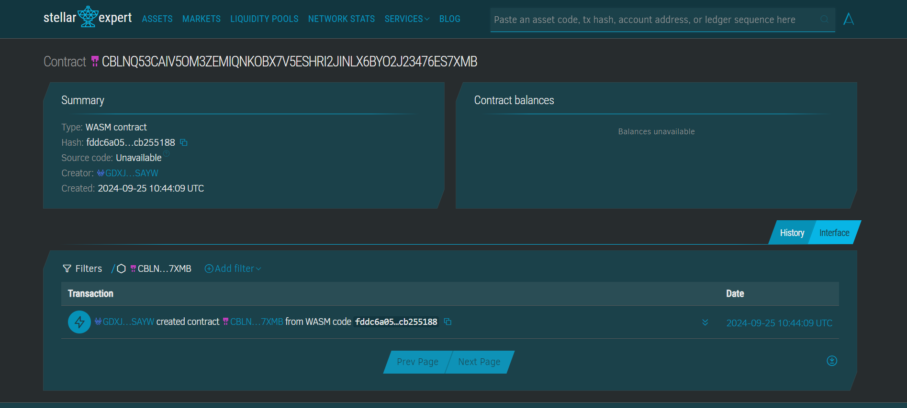

##### Deployed smartcontract address: CBLNQ53CAIV5OM3ZEMIQNKOBX7V5ESHRI2JINLX6BYO2J23476ES7XMB

# Crypto-based Microtransactions App

## Project Title
Crypto-based Microtransactions App

## Project Description
An application that enables small, frequent transactions using cryptocurrencies. Stellar’s fast and low-cost transactions are leveraged for seamless microtransactions, with smart contracts managing payment logic and user interactions.

## Project Vision
The goal of the Crypto-based Microtransactions App is to provide users with a reliable, low-cost, and efficient platform for conducting microtransactions in the crypto space. By leveraging Stellar's blockchain technology, the app ensures minimal transaction fees and swift payments, making it ideal for use cases such as tipping, digital purchases, and pay-per-use services.

## Key Features
- **Fast Transactions**: Stellar blockchain provides nearly instant transaction finality, ensuring quick payments for small, frequent transactions.
- **Low Fees**: The app utilizes Stellar’s low-cost transaction model, making microtransactions economically viable.
- **Smart Contract Management**: All payment logic is managed through secure and transparent smart contracts, ensuring safe transactions.
- **User-friendly Interface**: Intuitive design for seamless user interactions, ensuring a hassle-free experience for both sending and receiving funds.
- **Cryptocurrency Support**: Built with Stellar’s Lumens (XLM) as the main currency, offering a reliable and widely accepted form of payment.
